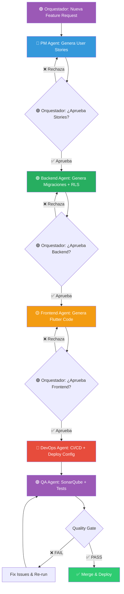

# 🤖 AI Multi-Agent Pipeline — Album 26 Sticker Collector

> **#AIChangesMyGame** — De "developer que escribe código" a "arquitecto que orquesta agentes de IA"

---

## 🎯 Visión General

Este proyecto utiliza un pipeline de **5 agentes de IA especializados** orquestados por un humano para desarrollar features completas en horas en lugar de días.

```
┌─────────────────────────────────────────────────────────────────────┐
│                    🟣 ORQUESTADOR HUMANO                            │
│         (Aprueba/Rechaza cada etapa del pipeline)                   │
└─────────────────────────────────────────────────────────────────────┘
        │
        ▼
┌───────────────┐    ┌───────────────┐    ┌───────────────┐
│ 🔵 Product    │───▶│ 🟢 Backend    │───▶│ 🟡 Frontend   │
│    Manager    │    │    Dev        │    │    Dev        │
│               │    │               │    │               │
│ User Stories  │    │ Supabase      │    │ Flutter       │
│ Acceptance    │    │ Migrations    │    │ Riverpod      │
│ Criteria      │    │ Edge Fns      │    │ UI + Tests    │
└───────────────┘    └───────────────┘    └───────────────┘
                                                  │
                                                  ▼
                     ┌───────────────┐    ┌───────────────┐
                     │ 🟣 QA Agent   │◀───│ 🔴 DevOps     │
                     │               │    │               │
                     │ SonarQube     │    │ Dockerfile    │
                     │ Auto Tests    │    │ CI/CD         │
                     │ Quality Gate  │    │ Deploy        │
                     └───────────────┘    └───────────────┘
```

---

## 📊 Métricas de Impacto

| Métrica | ANTES (manual) | DESPUÉS (con agentes) |
|---------|---------------|----------------------|
| Tiempo por feature | 3-5 días | 2-6 horas |
| Historias de usuario | 30-60 min escribiendo | 2 min revisando |
| Migraciones DB | 20-40 min | 5 min revisando |
| UI + lógica Flutter | 1-2 días | 30 min revisando |
| Tests | A veces olvidados | Siempre generados |
| Quality analysis | Manual/inexistente | Automático en cada PR |
| Deploy | Manual y propenso a errores | Automatizado |

---

## 🔵 Agente 1: Product Manager

**Rol**: Transforma una idea de feature en historias de usuario estructuradas.

**Input**: Descripción en lenguaje natural de lo que se quiere  
**Output**: 
- Historias de usuario (formato Given/When/Then)
- Criterios de aceptación
- Diagrama de flujo del feature
- Impacto en el modelo de datos

**Gate**: ✅ El orquestador revisa y aprueba las historias antes de continuar.

---

## 🟢 Agente 2: Backend Developer

**Rol**: Genera cambios en Supabase (migraciones, RLS, Edge Functions).

**Input**: Historias de usuario aprobadas  
**Output**:
- Migraciones SQL (`supabase/migrations/`)
- Row Level Security policies
- Edge Functions si aplica (`supabase/functions/`)
- Documentación del schema

**Gate**: ✅ El orquestador revisa las migraciones y policies antes de continuar.

---

## 🟡 Agente 3: Frontend Developer

**Rol**: Genera código Flutter siguiendo la arquitectura del proyecto.

**Input**: Historias de usuario + schema de backend aprobados  
**Output**:
- Modelos Brick (offline-first)
- Providers Riverpod
- Widgets de UI
- Tests unitarios y de widget

**Gate**: ✅ El orquestador revisa el código Flutter antes de continuar.

---

## 🔴 Agente 4: DevOps Engineer

**Rol**: Genera configuración de CI/CD y deployment.

**Input**: Código completo del feature  
**Output**:
- Dockerfile actualizado (si aplica)
- GitHub Actions workflows
- Configuración de environments
- Scripts de deploy

**Gate**: ✅ Automático si CI pasa; manual si falla.

---

## 🟣 Agente 5: QA Engineer

**Rol**: Análisis de calidad y seguridad automático.

**Input**: PR con todos los cambios  
**Output**:
- Análisis SonarQube (bugs, vulnerabilities, code smells)
- Coverage report
- Tests de integración adicionales
- Quality Gate (PASS/FAIL)

**Gate**: ✅ Quality Gate debe pasar para merge.

---

## 🔄 Flujo Completo



---

## 🛠️ Cómo Usar

### 1. Crear un Feature Request

Abre un issue usando el template "Feature Request (AI Pipeline)":

```
Título: Agregar sistema de logros por completar países
Descripción: Quiero que los usuarios vean badges cuando completen todos los cromos de un país.
```

### 2. El Pipeline se Activa

El GitHub Action `ai-pipeline.yml` se dispara y:
1. El PM Agent genera las historias
2. Crea un PR con las historias para tu revisión
3. Al aprobar, el siguiente agente se activa
4. Así sucesivamente hasta el deploy

### 3. Tú Orquestas

En cada etapa puedes:
- ✅ **Aprobar**: El pipeline continúa
- ❌ **Rechazar con comentario**: El agente regenera con tu feedback
- 🔄 **Modificar**: Editas directamente y continúas

---

## 📁 Estructura de Archivos

```
.github/
├── agents/
│   ├── product-manager.md      # Prompt del PM Agent
│   ├── backend-developer.md    # Prompt del Backend Agent
│   ├── frontend-developer.md   # Prompt del Frontend Agent
│   ├── devops-engineer.md      # Prompt del DevOps Agent
│   └── qa-engineer.md          # Prompt del QA Agent
├── workflows/
│   ├── ai-pipeline.yml         # Pipeline principal con gates
│   ├── sonarqube.yml           # Análisis de calidad
│   └── deploy.yml              # Deploy automático
└── ISSUE_TEMPLATE/
    └── feature-request-ai.yml  # Template para features
```

---

## 🏆 Por qué esto es #AIChangesMyGame

1. **No soy un "doer" que usa ChatGPT para autocompletar** — soy un **orquestador** que dirige un equipo de agentes especializados.
2. **Cada agente tiene contexto profundo** del proyecto (arquitectura Brick, Riverpod, Supabase).
3. **El humano mantiene el control** — apruebo/rechazo cada etapa.
4. **La calidad se garantiza** — SonarQube + tests automáticos en cada PR.
5. **Es reproducible** — cualquier feature nueva sigue el mismo pipeline.

---

*Built with ❤️ using AI agents for Sticker Album 2026*
